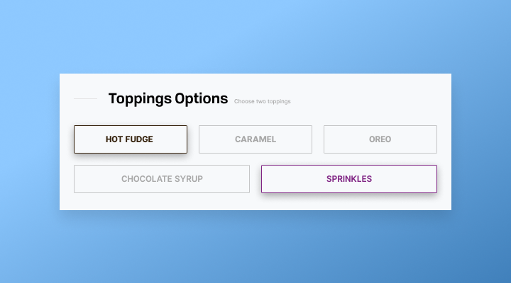

## chunk-pattern [](https://www.npmjs.com/package/chunk-pattern) [](https://travis-ci.org/srph/chunk-pattern)

Chunk an array in a specific pattern.

### Use-case
If you're building a reusable component that accepted options that get chunked into multiple rows with varying column count, you're in the right place.



<sup><em>Designed by [Kirby Borromeo](https://dribbble.com/kbyborromeo)</em></sup>

### Usage
```js
import chunkPattern from 'chunk-pattern'

const flavors = [
  'Chocolate',
  'Strawberry',
  'Green Tea',
  'Rocky Road',
  'Salted Caramel',
  'Vanilla',
  'Cheese',
  'Kit Kat',
  'Ube',
  'Pandan',
  'Blueberry'
]

console.log(
  chunkPattern(flavors, [2, 3])
)

/*
  ['Chocolate', 'Strawberry'],
  ['Green Tea', 'Rocky Road', 'Salted Caramel'],
  ['Vanilla', 'Cheese'],
  ['Kit Kat', 'Ube', 'Pandan'],
  ['Blueberry']
 */
```

### Installation
```bash
npm i chunk-pattern --save
```

### API
```js
chunkPattern(array: Array<mixed>, pattern: Array<number>): Array<Array<mixed>>
```

#### Parameters
- `array` is the array to be chunked in given `pattern`.
- `pattern` is the sequence in which you'd like your array to be chunked.

### Contributing
```bash
# Run tests
npm run test

# Create dist build
npm run build

# Format with Prettier
npm run fmt

# Run flow
npm run flow
```
